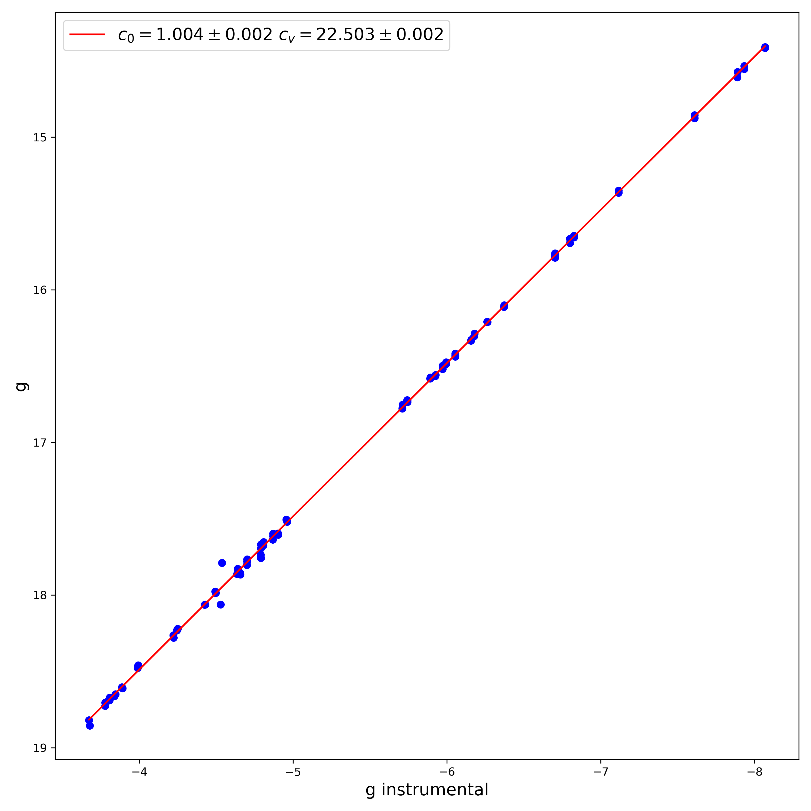
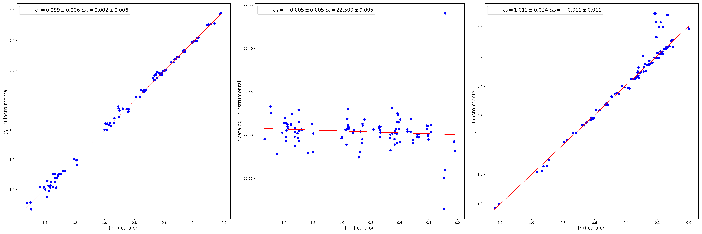

# Photometry reduction
---

Данная программа предназначена для перевода фотометрических изображений к стандартным фотометричесским системам. На данный момент доступны стандартные каталоги: NOMAD, SDSS, PanSTARRS.
Программа способна работаь в 2х основных режимах:
- Изображение в одном фильтре. В этом случае происходит линейное преобразование к стандартной системе, без корекции цветов.
- Обработка изображения в 3х цветовых полосах, что позволяет произвести цветовую коррекцию изображений.

Апертураная фотометрия проводилась при помощи пакета [photutils](https://photutils.readthedocs.io/en/stable)

## Установка:
Программа написана на языке [python 3](https://www.python.org).

Также для корректной работы необходимо установить [ds9](https://sites.google.com/cfa.harvard.edu/saoimageds9/home?authuser=0).

Ниже приведены используемы python пакеты:

```
pip3 install photutils astropy pathlib numpy scipy matplotlib joblib threadpoolctl scikit-learn 
```

## Пример использования программы:

Ниже приведена последовательность пунктов, которые рекомендовано учесть при запуске программы:

1. Программа запускается через основной скрипт main.py

 `python3 main.py`

2. В качестве обязательных аргументов необходимо подать на вход изображения:

`python3 main.py first_image.fits second_image.fits third_image.fits` --- для 3х цветового режима 

или

`python3 main.py first_image.fits N N` --- для монохроматического режима.
 

3. Далее посредством ключа `-с` выбирается один из каталогов: _NOMAD, SDSS, PS1_. (По умолчанию NOMAD)

`python3 main.py first_image.fits second_image.fits third_image.fits -c NOMAD`

4. Теперь необходимо выбрать цветовые полосы для каждого изображения. Указывать их следует слитно, без пробелов. Например, BVR. ОБРАТИТЕ ВНИМАНИЕ, что при запуске монохромного режима используется ПЕРВЫЙ из указываемых фильтров. Все последующие символы будут проигнорированы. (По умолчанию BVR)

`python3 main.py first_image.fits second_image.fits third_image.fits -c NOMAD -f BVR`

или 

`python3 main.py N N -c NOMAD -f R`

5. Для проведения корректной фотометрии стоит брать яркие, но не перенасыщенные изображения звёзд. Для регулировки есть два ключа `-lm` и `-um`. Они задают диапазон $LM \le m_{obs} \le UM$ из которого будут взяты стандарты. По умолчанию диапазон [14; 17]

`python3 main.py first_image.fits second_image.fits third_image.fits -c NOMAD -f BVR -lm 14 -um 17`

6. Ключом `--fwhm` задаётся оценочная FWHM звезды в пикселях. Её, к примеру, можно измерить при помощи программы ds9. Данная величина необходима для задания апретур. В данной программе используются круглые апертуры. Их радиус регулируется ключом `--k0`:
 
 $$ 
 r_{aper} = k0 \cdot FWHM (pix).
 $$
 
 Для локальной оценки фона используются круглые кольца, радиусами 
 
 $$
 r_{in} = k1 \cdot FWHM (pix) \quad r_{out} = k2 \cdot FWHM (pix).
 $$
 
 Они аналогично регулируются ключами `--k1` и `--k2`. (По умолчанию FWHM = 9 pix, k0 = 2; k1 = 2.5; k2 = 3)

`python3 main.py first_image.fits second_image.fits third_image.fits -c NOMAD -f BVR -lm=14 -um=17 --fwhm=9 --k0=2 --k1=2.5 --k2=3`

7. Также в программе доступен ручной режим посредством вызова ds9, позволяюший при необходимости вручную регулировать размеры апертур, а также удалять апертуры плохих источников. Подробнее о ручном режиме будет изложено ниже. Активация ручного режима происхожит при помощи ключа `--manual`

`python3 main.py first_image.fits second_image.fits third_image.fits -c NOMAD -f BVR -lm=14 -um=17 --fwhm=9 --k0=2 --k1=2.5 --k2=3 --manual`

8. По умолчанию все результаты работы программы сохраняются в той же дирректории, в которой был запущен скрипт. Для смены пути используйте ключ `-out`: 

`python3 main.py first_image.fits second_image.fits third_image.fits -c NOMAD -f BVR -lm=14 -um=17 --fwhm=9 --k0=2 --k1=2.5 --k2=3 --manual -out=path_to_output_dirrectory`

9. При обработке порой возникает необходимость отбросить объекты, близкие к краю изображения. Для этого существует параметр `-bdr`, задающий в пикселях рамку по краям всего изображения, данные из которой не будут учитываться при обработке. Отметим, что объект считается внутри рамки, если координаты его центра лежат в ней. (По умолчанию bdr=100)

`python3 main.py first_image.fits second_image.fits third_image.fits -c NOMAD -f BVR -lm=14 -um=17 --fwhm=9 --k0=2 --k1=2.5 --k2=3 --manual -out=path_to_output_dirrectory -bdr=100`

10. Если возникает необходимость замаскировать часть изображения, то для этого существует ключ `-p2m` В нем узазывется путь до FITS  файла маски.

`python3 main.py first_image.fits second_image.fits third_image.fits -c NOMAD -f BVR -lm=14 -um=17 --fwhm=9 --k0=2 --k1=2.5 --k2=3 --manual -out=path_to_output_dirrectory -bdr=100 -p2m mask.fits`

Мы описали все ключи, используемые при запуске данной программы. Для получения информации во время работы используйте ключ `-h`

## Результат работы программы

В результате работы программы имеются:
- FITS файлы изображений, приведенные к стандартной фотометрической системе.
- Рисунок, отображающий звёзды, используемые для колибровки
- Регионовские файлы DS9, используемых апертур
- Таблица с результатами фотометрии и стандартами
- Уравнения перехода, полученные по обработанным данным.

## Алгоритм работы программы


## Примечания

### Ручной режим

В ручном режиме появляется возможность удалять "плохие апертуры". Так, например, можно исключить звёзды, спроецированные на галактику или имеющие артефакты. 

Рассмотрим пример работы с ручным режимом.

После отождествления звёзд кадра с каталогом открывается окно ds9. Апертуры звёзд отмечены зелеными окружностями. Красные кольца соответсвуют областям локльной оценки фона.


Как видим на изображении часть звёзд лежит на диске галактики. Также некоторые галактики отмечены как звёзды. Удалим их. 

Для этого следует перейти по вкладкам **Edit >> Region**. 

После чего выбрать нужные регионы и нажать на клавиатуре **Delete**. 

Теперь необходимо сохранить регионовский файл. **Region >> Save**. Выбрать _aper.reg_ и выбрать **image**.


Теперь окно можно закрывать. Программа продолжит работу. 

Как видим на итоговом изображении ниже, удалённые звёзды отсутствуют.


**ВАЖНО:** на данный момент нет учета поправки за апертуру при разных апертурах для звёзд. Поэтому не рекомендуется менять апертуры отдельных звёзд. 

### Поправки за апертуру

При выполнении апертурной фотометрии мы не принимаем излучение звезды за пределами апертуры. Чтобы учесть вклад звёздных крыльев строится кривая роста и оценивается поправка за аперутру. Опишем метод, используемый в данной программе.

Мы используем предположение, что функция размытия точки не меняется на протяжении всего кадра. 

Пусть у нас есть измеренный профиль для звёзд $f_1(x, y)$. Тогда для другой звезды профиль будет таким же, но домноженный на коэфециент $\alpha$, те:

$$
f_2(x, y) = \alpha f_1(x, y) \qquad (1)
$$

Поток от звезды пропорционален интегралу по профилю:

$$
F \sim \int\limits_{\Omega} f(x, y) dx dy \qquad (2.1)
$$

или

$$
F \sim \int\limits_{\Omega} rf(r, \phi) dr d\phi \qquad (2.2)
$$

Сам поток $F$ состоит из потока внутри апретуры $F^{ap}$ и поправки $\Delta F$, где 

$$
F^{ap} \sim \int\limits_{0}^{r_{ap}}\int\limits_0^{2\pi} r f(r, \phi) dr d\phi \qquad \Delta F \sim \int\limits_{r_{ap}}^{\infty}\int\limits_0^{2\pi} r f(r, \phi) dr d\phi
$$

Из (1) очевидно, что

$$
F_2^{ap} = \alpha F_1^{ap} \qquad \Delta F_2 = \alpha \Delta F_1
$$

Получаем, что:

$$
F_2 = F^{ap}_2 + \Delta F_2 = F^{ap}_2 + \frac{F^{ap}_2}{F^{ap}_1} \Delta F_1 = F^{ap}_2 (1 + \frac{\Delta F_1}{F^{ap}_1})
$$

В звёздных величинах  имеем:

$$
m_2 = m^{ap}_2 -2.5 \log(1 + \frac{\Delta F_1}{F^{ap}_1}) = m^{ap}_2 + \Delta m
$$

Таким образом нам не обязательно знать сам профиль звезды, чтобы оценить поправку за апертуру. Мы просто берем несколько ярких звёзд и для каждой из них определяем $\Delta m$. После чего усредняем.

### Тест работы программы

Для проверки работы программы был взят кадр SDSS RA=184.2428 DEC=66.5268 в трёх фильрах  g, r и i.

Параметры запуска:

1. Монохромный режим

```
python3 main.py test_images/sdss_cutout_184.2428_66.5268_g.fits N N -c SDSS -f g -out test_results -lm=14 -um=19 --fwhm=6.5 --bdr=20
```



2. Трёхцветовой режим

```
python3 main.py test_images/sdss_cutout_184.2428_66.5268_g.fits test_images/sdss_cutout_184.2428_66.5268_r.fits test_images/sdss_cutout_184.2428_66.5268_i.fits -c SDSS -f gri --fwhm=6.5  -out test_results -lm=10 -um=19 --bdr=20  
```



Истинное уравнение перехода:

$$
m_{catalog} = m_{instrumental} + 22.5
$$


